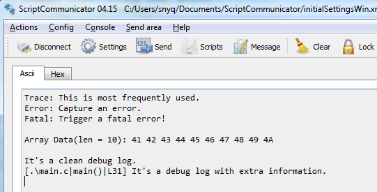

# logger
A log4j like system for PSoC project.

## Feature:

1. Level control. 

   Available levels are: 

   - LOGGER_LEVEL_DISABLE
   - LOGGER_LEVEL_FATAL
   - LOGGER_LEVEL_ERROR
   - LOGGER_LEVEL_TRACE
   - LOGGER_LEVEL_DEBUG

   LOGGER_LEVEL_DISABLE will disable all message display, and even don't start SCB component, which is useful in the final firmware of those power sensitive systems.

   LOGGER_LEVEL_TRACE will enable TRACE, ERROR and FATAL messages.

   LOGGER_LEVEL_DEBUG will enable all levels of messages. 

   Of course, you can add more levels as per your requirement.

2. Dynamical baud rate configuration

   Use an external clock component to enable set baud rate in the run-time. The baud rate is assigned in logger.start() API.

   All baud rates supported in SCB component should be supported here.

3. `Printf` like syntax

   This system uses the same syntax like standard printf function. 

4. `p()` and `d()` macro

   d() will print out the file path, function name and line number of the caller. p() is a wrapper of printf.

5. Error prompt

   Don't have to put up with heap size, messy code issues.


## Usage:

1. Copy SCB and clock components to your own project.
2. Include logger.h and start it via `logger.start` function.
3. Print trace message via `logger.t`, error message via `logger.e`, fatal message via `logger.f`. 
4. Print array data via `logger.array`, this function is ended with '\r\n'. 
5. Print debug information via `d` or `p` macro. 


That's all. 

## Test

Try to run below code:

```C
    CyGlobalIntEnable;
    
    logger.start(LOGGER_LEVEL_DEBUG, UART_BAUD_RATE_115200);
	
    logger.t("Trace: This is most frequently used.\r\n");
    logger.e("Error: Capture an error.\r\n");
    logger.f("Fatal: Trigger a fatal error!\r\n");
	
    logger.t("\r\nArray Data(len = %d): ", 10);
    uint8 testData[10] = {'A', 'B', 'C', 'D', 'E', 'F', 'G', 'H', 'I', 'J'};
	logger.list(testData, 10);
	
	p("\r\nIt's a clean debug log.\r\n");
    d("It's a debug log with extra information.\r\n");  
```

Get the output in the UART terminal like below:



## Note:

It require global interrupt enabled, so make sure `CyGlobalIntEnable` is called before printing.

Heap size should be largger than 0x200, which is required by vprintf.

The over-sampling parameter of SCB component is set to 10 from 12, in order to fit most baud rates.
