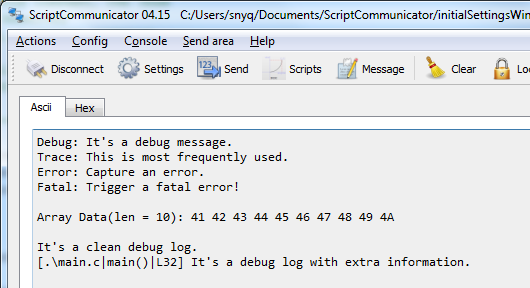

# logger
A log system for PSoC project.

## Feature:

1. Level control. 

   Available levels are: LOGGER_LEVEL_DISABLE, LOGGER_LEVEL_FATAL, LOGGER_LEVEL_ERROR, LOGGER_LEVEL_TRACE, LOGGER_LEVEL_DEBUG. 

   LOGGER_LEVEL_DISABLE will disable all message display, and even don't start SCB component, which is useful in the final firmware of those power sensitive systems.

   LOGGER_LEVEL_DEBUG should be most useful.

   Of course, you can modify it as per your requirement.

2. Dynamical baud rate configuration

   Assign baud rate in API logger_start().

   All baud rates supported in SCB component are supported here.

3. Printf syntax

   This system uses the same syntax like standard printf function. 

   Improve the using experience of printf.

4. `p()` macro

   This macro is useful when debugging system, as it will print out file path and function name of the target.

   Also it's easy to add line number in this function if required.

5. Good error prompt

   You don't have to put up with heap size, messy code issues.

## Usage:

1. Copy SCB and clock components to your own project, make sure the names are not changed. (You can change them as per your project, only need to fix some macro name errors happen in logger.h)

2. Include logger.h in your file and start logger system via `logger_start` function, with logger level and uart baud rate.

3. Print trace message via `logger.t`, error message via `logger.e`, fatal message via `logger.f`. 

4. Print array data via `logger_array`, this function is ended with '\r\n'. Print debug information via `p` macro. 

That's all. Please check main.c for reference.

## Screenshot

## Note:

Heap size should be largger than 0x200, otherwise printf function can't work well.